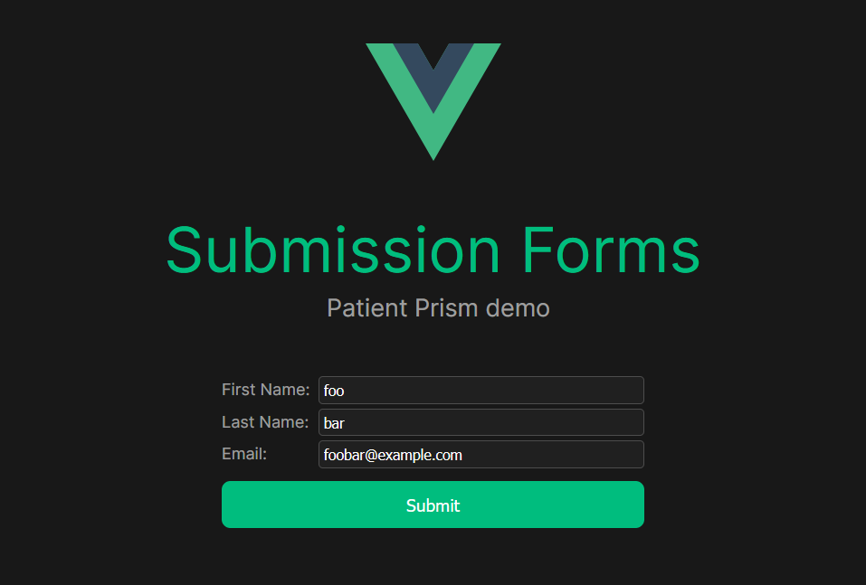

# Submission Forms

This demo demostrates how to use the submission send functionality of the Prism SDK with a form.

If you want to test with your own Code Snippet, replace the `<script>` tag for the snippet in the `index.html` file for this demo.



Which results in the following in the Patient Prism platform


## Run Demo

```sh
npm install
npm run dev
```
