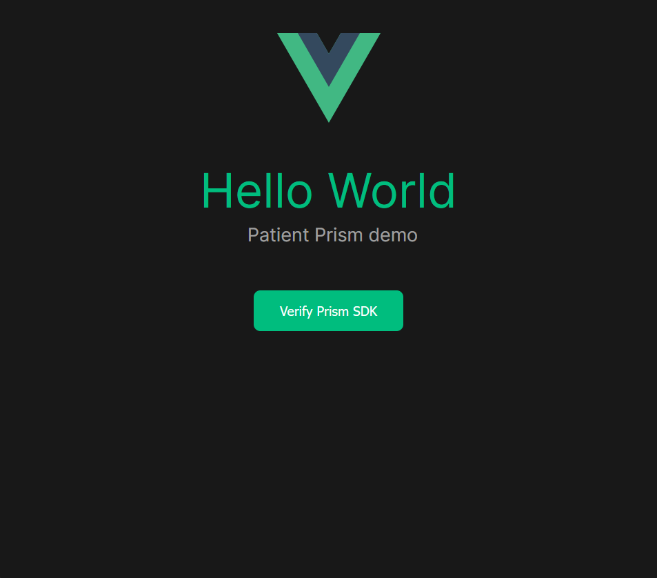

# Hello World

A basic showcase of interacting with the Prism SDK.

If you want to test with your own Code Snippet, replace the `<script>` tag for the snippet in the `index.html` file for this demo.



## Run Demo

```sh
npm install
npm run dev
```
